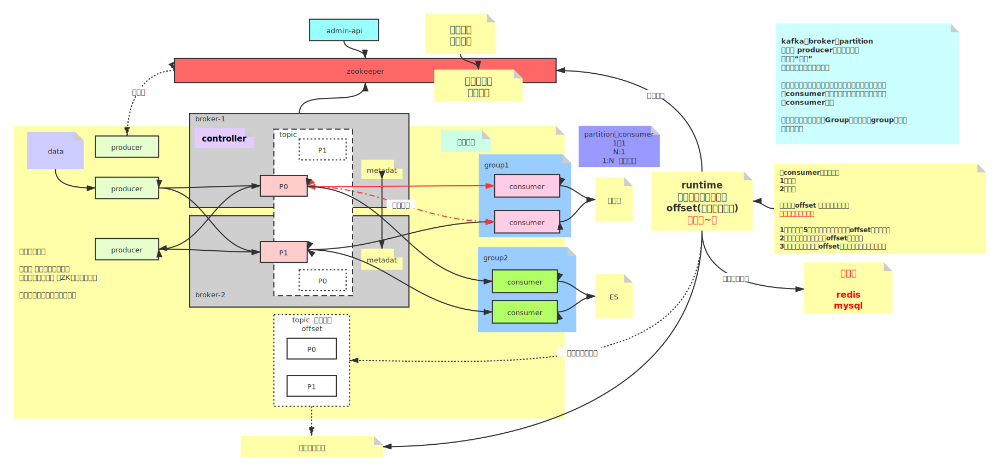

# Day01

## 简介

Kafka 为一个消息中间件，可用于服务之间的解耦。可靠，可扩展，高性能

## Kafka 的 AKF

- 通过副本保证可用（多节点），主节点负责读写，副本不对外提供服务，保证数据一致（X）
  > 复制集群有两种提供服务方式：1. 主从复制，读写分离，写操作只发生在主节点，保证吞吐量，牺牲一致性。2. 主备复制，主节点负责读写，副本不对外提供服务，保证数据一致，牺牲吞吐量
- 通过不同的 topic 进行逻辑业务划分（Y）
- topic 中通过 partition 在进行细分，无关的数据打散到不同的 partition 中，以追求并发，并行。有关的数据放到同一个 partition 中以保证顺序性（Z）

## 内部角色划分

### Zookeeper

  Kafka 依赖 Zookeeper 对 Broker 进行注册管理

### Broker

  Broker 是 Kafka 中的物理划分，可以存在多个 Broker，不同的 Broker 可以接收同一个 Topic 的消息

### Topic

  Topic 是 Kafka 中的逻辑划分，一个 Topic 中包含多个 Partition

### Partition

  Partition 是物理划分，多个 Partition 存储同一个 Topic 的内容，Partition 可以存在副本

### Producer

  Producer 是消息的生产者，Producer 通过向 Broker 获取集群信息。Producer 和 Partition 可以多对多。当多个 Producer 进行消息的生产的时候，需要注意数据推送的顺序性，可以通过分布式锁实现多个 Producer 向同一个 Partition 丢数据

### Consumer

  Consumer 是消息的消费者，Consumer 和 Partition 之间可以一对一或者一对多，但是不可以一个 Partition  中的消息被多个 Consumer 消费，这样可以避免破坏消息的顺序性。但是如果希望一个 Partition 中的消息被多个 Consumer 消费，那么需要满足这多个 Consumer 在不同的 Group。
  Consumer 中内存中维护了消息的 offset（消息的消费进度）。offset 的持久化：低版本是存储在 ZK 中，高版本是存储在内部的一个 Topic 中（推荐），也可以自定义存储在第三方。但是 offset 的更新时机会影响消息的丢失或者重复消费。如果先更新 offset 然后 Consumer 宕机，重启后消息丢失。如果先处理了消息，然后 Consumer 宕机没有更新 offset，重启后会造成消息的重复消费。

### Group

  多个 Consumer 可以位于同一个 Group，但是某个 Partition 中的消息只能被当前 Group 中的一个 Consumer 消费

## 课件

