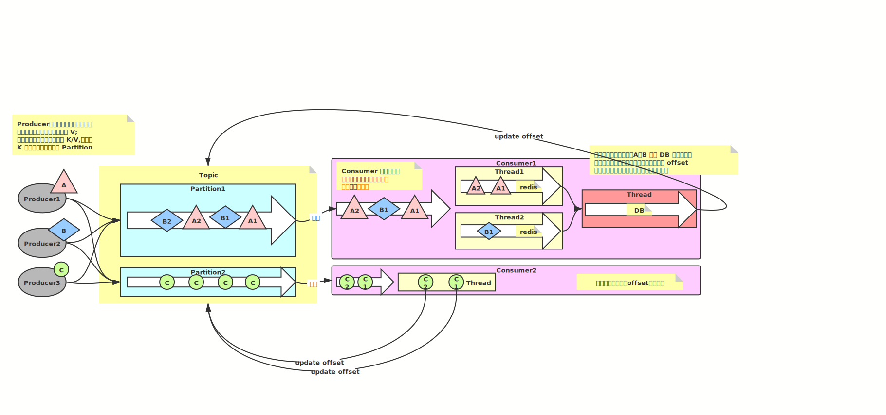

# Day02

## Kafka 集群启动

1. 启动 Zookeeper
2. 修改 Kafka 的配置文件 server.properties
  broker.id=0
  listeners=PLAINTEXT://localhost:9092
  log.dirs=/usr/local/Cellar/kafka/data/kafka
  zookeeper.connect=localhost:2181/kafka
3. 启动 Broker: kafka-server-start.sh ../config/server.properties

## Topic action

- create
  kafka-topics.sh --zookeeper localhost:2181/kafka --create --topic
  [topicName] --partitions [num] --replication-factor [num]
- get list
  kafka-topics.sh --zookeeper localhost:2181/kafka --list
- get desc
  kafka-topics.sh --zookeeper localhost:2181/kafka --describe --topic [topicName]

## Consumer action

- create
  kafka-console-consumer.sh --bootstrap-server localhost:9093 --topic [topicName] --group [groupName]
  > 当同一个 Group 的 Consumer 个数大于 Partition 的个数时，超过的个数的 Consumer 不会接受到数据

## Producer action

- create
  kafka-console-producer.sh --bootstrap-server localhost:9093 --topic [topicName]

## Group action

- get list
  kafka-consumer-groups.sh --bootstrap-server localhost:9093 --list
- get describe
  kafka-consumer-groups.sh --bootstrap-server localhost:9093 --describe --group [groupName]

## Kafka 同一个分区的消息顺序性的保证和高性能消费方案

